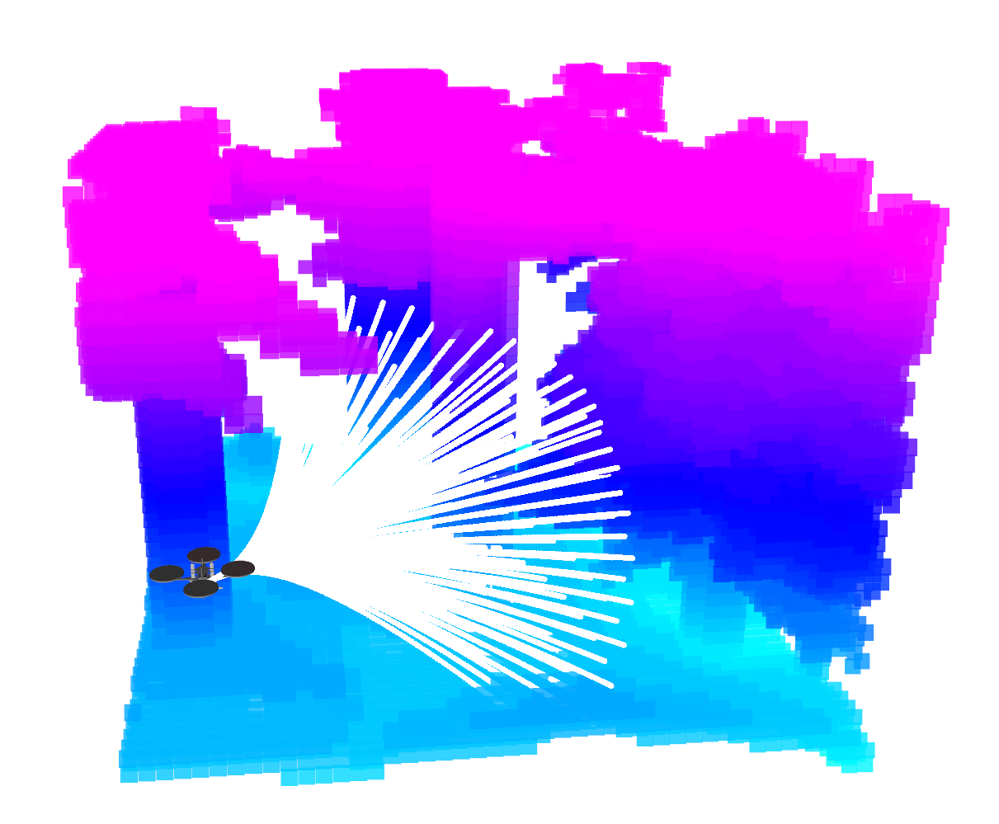
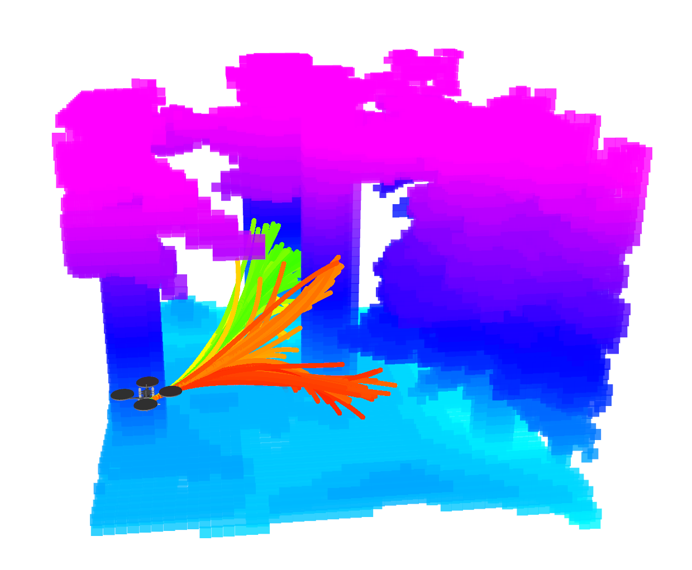
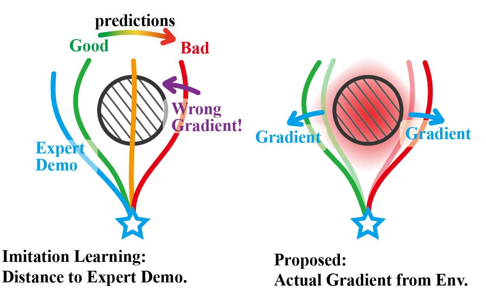

# You Only Plan Once

Paper: [You Only Plan Once: A Learning-Based One-Stage Planner With Guidance Learning](https://ieeexplore.ieee.org/document/10528860)

Video of this paper can be found: [YouTube](https://youtu.be/m7u1MYIuIn4), [bilibili](https://www.bilibili.com/video/BV15M4m1d7j5)

Some realworld experiment: [YouTube](https://youtu.be/LHvtbKmTwvE), [bilibili](https://www.bilibili.com/video/BV1jBpve5EkP)

## Introduction:
We proposed **a learning-based planner for autonomous navigation in obstacle-dense environments** which intergrats (i) perception and mapping, (ii) front-end path searching, and (iii) back-end optimization of classical methods into a single network. 

Considering the multi-modal nature of the navigation problem and to avoid local minima around initial values, our approach adopts a set of motion primitives as anchor to cover the searching space, and predicts the offsets and scores of primitives for further improvement (like the one-stage object detector YOLO). 

Compared to giving expert demonstrations for imitation in imitation learning or exploring by trial-and-error in reinforcement learning, we directly back-propagate the numerical gradient (e.g. from ESDF) to the weights of neural network in the training process, which is realistic, accurate, and timely.

<table>
    <tr>
        <td align="center" style="border: none;"></td>
        <td align="center" style="border: none;"></td>
		<td align="center" style="border: none;"></td>
    </tr>
    <tr>
        <td align="center" style="border: none;">primitive anchors</td>
        <td align="center" style="border: none;">predicted traj and scores</td>
		<td align="center" style="border: none;">learning method</td>
    </tr>
</table>

## Acknowledgements: 

This project is developed based on the open-source simulator [Flightmare](https://github.com/uzh-rpg/flightmare) and the gradient computation is modified from [grad_traj_optimization](https://github.com/HKUST-Aerial-Robotics/grad_traj_optimization), thanks for their excellent work!

## Installation

The project was tested with Ubuntu 20.04 and Jetson Orin/Xavier NX.

**0. Clone the code**
```
git clone git@github.com:TJU-Aerial-Robotics/YOPO.git
```
We will take the directory `~/YOPO` as example in the following.

**1. Flightmare Dependencies**

```
sudo apt-get update && apt-get install -y --no-install-recommends \
   build-essential \
   cmake \
   libzmqpp-dev \
   libopencv-dev \
   libpcl-dev
```

**2. Add sourcing of your catkin workspace as FLIGHTMARE_PATH environment variable:**
```
# modify "~/YOPO" to your path
echo "export FLIGHTMARE_PATH=~/YOPO" >> ~/.bashrc
source ~/.bashrc
```
**3. Unity:** 

Download the Flightmare Standalone uploaded by [uzh-rpg
/agile_autonomy](https://zenodo.org/records/5517791/files/standalone.tar), extract it and put in the `flightrender` folder.
It should looks like:
```
flightrender/
├── CMakeLists.txt
└── RPG_Flightmare/
    ├── flightmare.x86_64
    └── ...
```

**4. Create a conda virtual environment.**
```
conda create --name yopo python=3.8
conda activate yopo

conda install pytorch torchvision torchaudio pytorch-cuda=11.8 -c pytorch -c nvidia
pip install opencv-python
pip install gym stable-baselines3==1.5.0 
pip install scipy scikit-build ruamel-yaml==0.17.21 numpy==1.22.3 tensorboard==2.9.1 empy catkin_pkg
```
**5. build the flightlib** 
```
conda activate yopo
cd YOPO/flightlib/build
cmake ..
make -j8
pip install .
```
**6. Some issues may arise when we test on different devices.**

6.1. No module named 'flightpolicy' 

```
# modify "~/YOPO/flightpolicy" to your path
echo "export PYTHONPATH=$PYTHONPATH:~/YOPO" >> ~/.bashrc
source ~/.bashrc
```
6.2. No module named 'flightgym'
```
cd YOPO/flightlib/build
pip install -e .
```

## Train the Policy
**1. Data Collection:** For efficiency, we proactively collect dataset (images and states) by randomly initializing the drone's state (position and orientation). We randomly sample multiple velocities and accelerations for each image during the training process. The distribution of random sampled velocity is as `/docs/distribution_of_sampled_velocity.png`. It may take nearly 1 hour for collection with default dataset size but you only need to collect once. The data will be saved at `run/yopo_sim`.
```
cd ~/YOPO/run
conda activate yopo
python data_collection_simulation.py
```

**2. Training:** 
```
cd ~/YOPO/run
conda activate yopo
python run_yopo.py --train=1
```
It may take 2-3 hours to traing with default dataset size and training epoch. If everything goes well, the training log is as follows:

<p align="center">
    
</p>

Besides, you can refer to [quadrotor_env.yaml](./flightlib/configs/quadrotor_env.yaml), [vec_env.yaml](./flightlib/config/vec_env.yaml) and [traj_opt.yaml](./flightlib/config/traj_opt.yaml) for some modifications of quadrotor, environment, and trajectory optimization.

## Test the Policy

You can test the policy using pre-trained weights we provide at `run/saved/YOPO_1/Policy/epoch0_iter0.pth`. (For example, to use the weights of `YOPO_1/Policy/epoch2_iter3.pth`, you should use `--trial=1 --epoch=2 --iter=3`)

**1. Test without dynamics model and controller (simple but not recommended).**


```
cd ~/YOPO/run
conda activate yopo
python run_yopo.py --train=0 --render=1 --trial=1 --epoch=0 --iter=0 
```

It will take a while for unity setup, and then you will see:
<p align="center">
    
</p>

**2. Test with dynamics model and controller (recommended).**

**Prapare:** We did not use the built-in dynamics of Flightmare; instead, we used a ROS-based simulator and controller from [Fast Planner](https://github.com/HKUST-Aerial-Robotics/Fast-Planner). For your convenience, we have extracted only the relevant sections from the project, which you can refer to [UAV_Simulator](https://github.com/TJU-Aerial-Robotics/UAV_Simulator) for installation.

Besides, we recommend using tmux & tmuxinator for terminal management.

**2.1** Start the simulation environment with Unity and the ROS interface (It will take some time to load Unity and randomly generate a new environment)

```
cd ~/YOPO/flightrender/RPG_Flightmare
./flightmare.x86_64
```

```
cd ~/YOPO/flightlib/build
./flightros_node
```

Besides, you can refer to [quadrotor_ros.yaml](./flightlib/configs/quadrotor_ros.yaml) for some modifications.

**2.2** Start the dynamics simulation and controller of UAV
```
cd ~/UAV_Simulator
source devel/setup.bash
roslaunch so3_quadrotor_simulator simulator.launch
```

**2.3** Start the YOPO inference and the planner (the implementation of yopo_planner_node will be moved to test_yopo_ros.py in the future)

```
cd ~/YOPO/run
conda activate yopo
python test_yopo_ros.py --trial=1 --epoch=0 --iter=0
```

```
cd ~/YOPO/flightlib/build
./yopo_planner_node
```

**2.4** Visualization: start the RVIZ and publish the map.
Then you can click the `2D Nav Goal` on RVIZ as the goal at will, just like the following GIF.
```
cd ~/YOPO/
rviz -d yopo.rviz
```

```
cd ~/YOPO/flightlib/build
./map_visual_node
```

<p align="center">
    
</p>


## TensorRT Deployment
We highly recommend using TensorRT for acceleration when flying in real world. It only takes 1ms for inference on NVIDIA Orin NX.

**1. Prepera:**
```
conda activate yopo
pip install -U nvidia-tensorrt --index-url https://pypi.ngc.nvidia.com

git clone https://github.com/NVIDIA-AI-IOT/torch2trt
cd torch2trt
python setup.py install
```
**2. PyTorch model to TensorRT model**
```
cd ~/YOPO/
conda activate yopo
python yopo_trt_transfer.py --trial=1 --epoch=0 --iter=0
```
**3. TensorRT Inference**
```
cd ~/YOPO/
conda activate yopo
python test_yopo_ros.py --use_tensorrt=1
```

## Finally
We are still working on improving and refactoring the code to improve the readability, reliability, and efficiency. For any technical issues, please feel free to contact me (lqzx1998@tju.edu.cn) 😀 We are very open and enjoy collaboration!

If you find this work useful or interesting, please kindly give us a star ⭐; If our repository supports your academic projects, please cite our paper. Thank you!