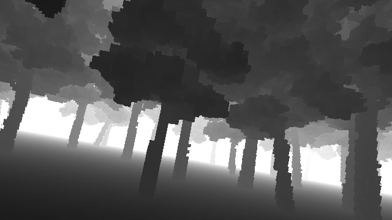
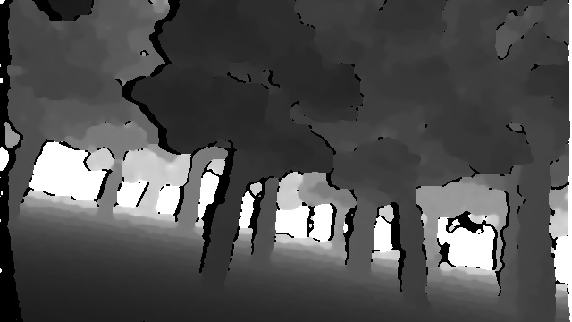
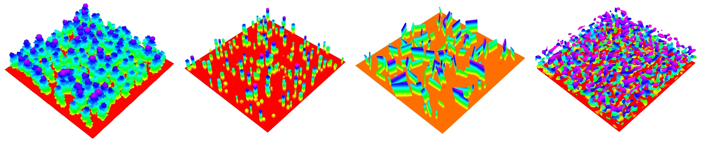

# 真实环境点云/深度图仿真(支持CUDA, Stereo Depth)

### 1 依赖

CUDA; ROS; OpenCV; PCL; (如果已经安装ROS依赖基本都满足) yaml-cpp
```angular2html
sudo apt-get install libyaml-cpp-dev
```

### 2 编译
```angular2html
catkin build
```
注：在CmakeList中采用`cuda_select_nvcc_arch_flags`自动检测，如果遇到编译错误，你需要手动设置CUDA架构，请将CmakeList 25行起：
```
cuda_select_nvcc_arch_flags(ARCH_FLAGS)
...
endif()
```
替换为(5060 GPU是120, 需要根据自己设备设置)：
```
set(ARCH_FLAGS "-gencode arch=compute_120,code=sm_120")
```

### 3 运行
```angular2html
source devel/setup.bash
# GPU版本 (推荐, RTX 3060 深度输出 > 1000fps)
rosrun sensor_simulator sensor_simulator_cuda

# CPU版本 (资源占用高，仅供GPU编译失败无法解决时测试)
rosrun sensor_simulator sensor_simulator
```

传感器参数以及点云环境修改见[config](config/config.yaml)，重要参数说明:
```
# 一些话题
odom_topic: "/sim/odom"
depth_topic: "/depth_image"
lidar_topic: "/lidar_points"
# 使用预先构建的点云地图还是随机地图
random_map: true
# 随机地图配置
maze_type: 5   # 1: 溶洞 2: 柱子 3:迷宫 5:森林 6:房间
```

### 4 仿真位置发布与简单可视化（可选）
```angular2html
cd src/sensor_simulator
python sim_odom.py

cd src/sensor_simulator
rviz -d rviz.rviz
```


### 5 实时性与资源占用

cpu 版本 (i7-9700)：
深度图0.02s, 点云0.01s

gpu 版本 (RTX 3060)：
深度图0.001s, 点云0.001s

GPU版资源占用(开30HZ)：


### 6 双目深度
在[config](config/config.yaml)中开启`render_stereo`以渲染双目深度：

<table align="center">
  <tr>
    <td align="center">
      
      <br/>
      1. Ground-Truth Depth
    </td>
    <td align="center">
      
      <br/>
      2. Stereo Depth
    </td>
  </tr>
</table>

### 7 示例场景
场景：


感知：
<table>
  <tr>
    <td align="center">
      
      <p>1. realworld forest</p>
    </td>
    <td align="center">
      
      <p>2. realworld building</p>
    </td>
  </tr>
  <tr>
    <td align="center">
      
      <p>3. 3D perlin</p>
    </td>
    <td align="center">
      
      <p>4. random forest</p>
    </td>
  </tr>
  <tr>
    <td align="center">
      
      <p>5. random room</p>
    </td>
    <td align="center">
      
      <p>6. random maze</p>
    </td>
  </tr>
</table>

**注释:**

1. GPU版本地图无边界可无限延伸; CPU版本地图有边界（可选择复制地图几份，已弃用）

### Acknowledgment

Some maps (3D Perlin, random maze) are generated based on: https://github.com/HKUST-Aerial-Robotics/mockamap, 
stereo depth matching is based on: https://github.com/angli66/simsense,
thanks for their excellent work!